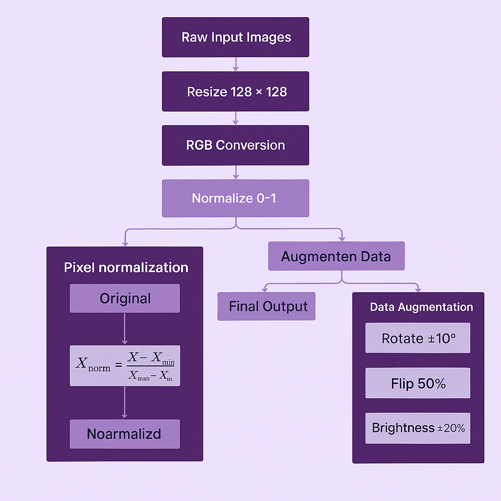
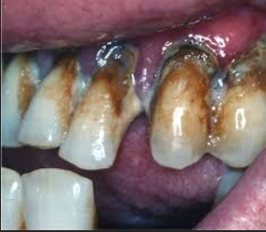
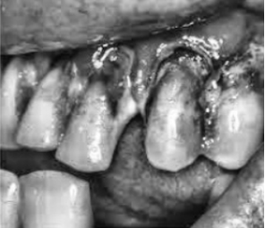
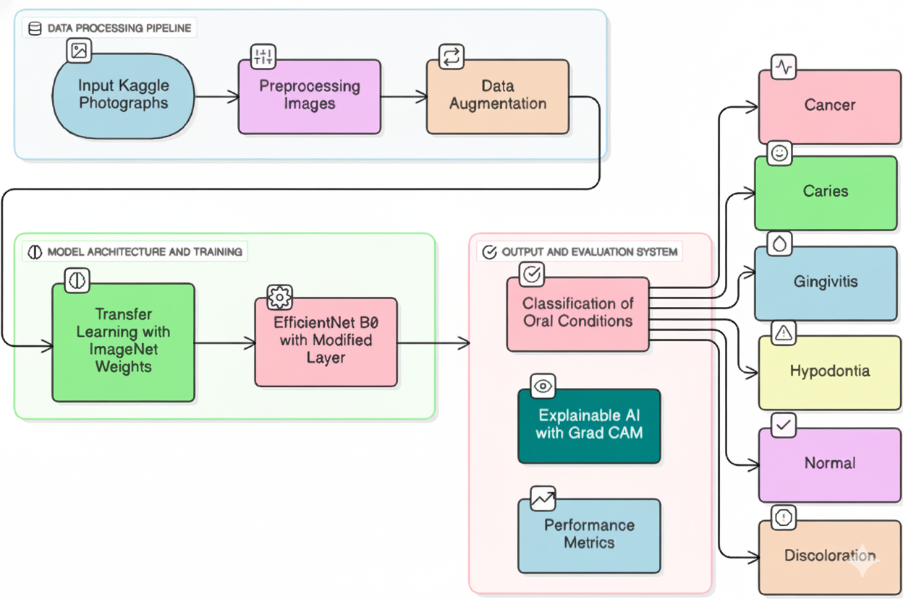
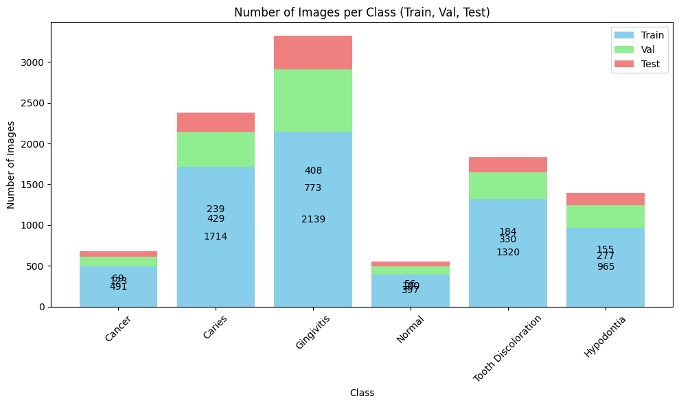
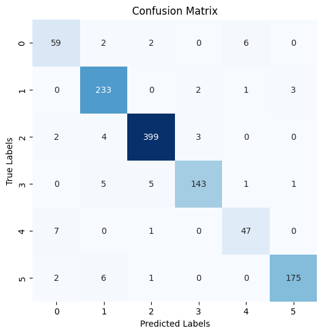
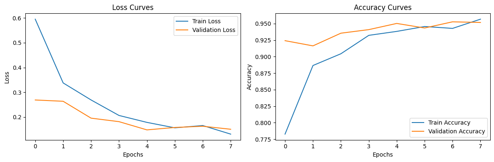

# 🦷 Early Detection of Oral Cancer and Other Dental Pathologies Using EfficientNet-B0

  

---

## 📌 Overview

This repository contains the implementation of a **deep learning–based framework** for the **early detection of oral cancer and other dental pathologies** using the **EfficientNet-B0** architecture.

The system performs **multi-class classification** on intraoral images and is designed to assist dentists and medical professionals with **early, accurate, and automated diagnosis**.

📄 This work is **published in IEEE** and is part of an academic research study.

---

## 📄 Research Publication

* **Title:** Early Detection of Oral Cancer and Other Dental Pathologies Using EfficientNet-B0
* **Publisher:** IEEE
* **Authors:** Ankita Subhash Patil *et al.*

---

## 🦷 Disease Categories

The model classifies oral images into **six categories**:

* Oral Cancer
* Dental Caries
* Gingivitis
* Hypodontia
* Tooth Discoloration
* Normal (Healthy Teeth)

---

## 🗂 Dataset

* **Source:** Publicly available Kaggle datasets
* **Type:** Intraoral dental images
* **Data Split:**

  * Training: 80%
  * Validation: 10%
  * Testing: 10%

  

---

## 🗂 Dataset Samples

  

---

## 🧪 Image Preprocessing

The following preprocessing techniques were applied:

* Image resizing to **224 × 224**
* RGB conversion
* Min–Max normalization (0–1)
* Data augmentation:

  * Rotation (±15°)
  * Horizontal flipping
  * Brightness and contrast adjustment

  

  

---

## 🧠 Model Architecture

* **Base Model:** EfficientNet-B0 (pre-trained on ImageNet)
* **Technique:** Transfer Learning
* **Optimizer:** Adam
* **Loss Function:** Hierarchical Cross-Entropy
* **Batch Size:** 32
* **Epochs:** 50

  

---

## 📊 Performance Evaluation

### 🔢 Metrics Used

* Accuracy
* Precision
* Recall
* F1-Score

### 📈 Model Comparison

| Model               | Accuracy | Precision | Recall  | F1-Score |
| ------------------- | -------- | --------- | ------- | -------- |
| DenseNet            | 94%      | 91%       | 87%     | 89%      |
| ResNet              | 94%      | 91%       | 89%     | 90%      |
| **EfficientNet-B0** | **95%**  | **93%**   | **92%** | **92%**  |

  

---

## 📊 Confusion Matrix

  

---

## 📈 Training & Validation Performance

  

  

✔ Achieved **95% accuracy**
✔ No significant overfitting
✔ Stable training and validation curves

---

## 📁 Project Files

* `EfficientNet (6).ipynb` – Proposed EfficientNet-B0 implementation
* `ResNet.ipynb` – Baseline comparison model
* `Densnet.ipynb`-Baseline comparison model
* `README.md` – Project documentation

---

## 🚀 Applications

* Early oral cancer detection
* AI-assisted dental diagnosis
* Clinical decision support systems
* Rural and remote healthcare screening

---

## 🔮 Future Work

* Larger and more diverse datasets
* Real-world clinical trials
* Mobile and web-based deployment
* Explainable AI (Grad-CAM visualization)

---

## 🧑‍💻 Author

**Ankita Subhash Patil**
CSE – Artificial Intelligence
📧 Email: [95ankita.s.patil@gmail.com](mailto:95ankita.s.patil@gmail.com)

---

## ⭐ Acknowledgment

This project is developed as part of an **IEEE-published research study** in the domain of **Healthcare AI and Medical Image Analysis**.

If you find this work useful, please ⭐ **star the repository**.

---

